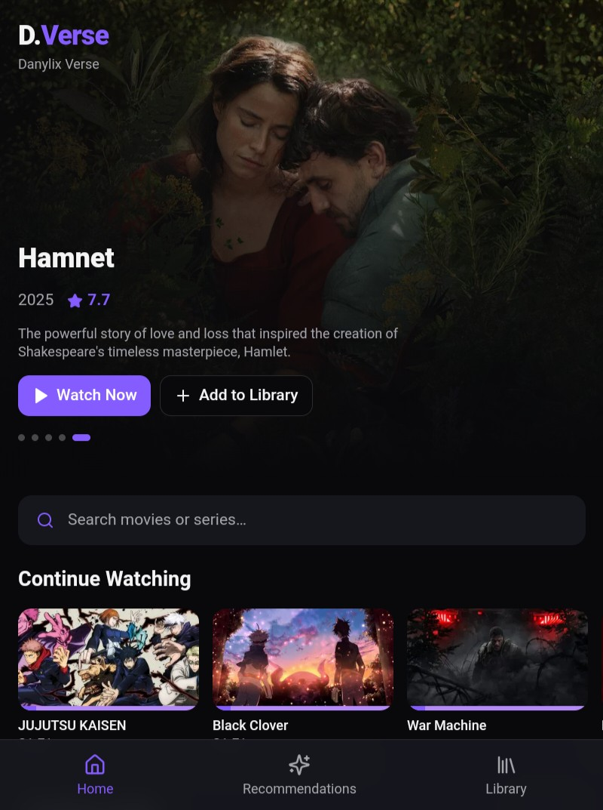
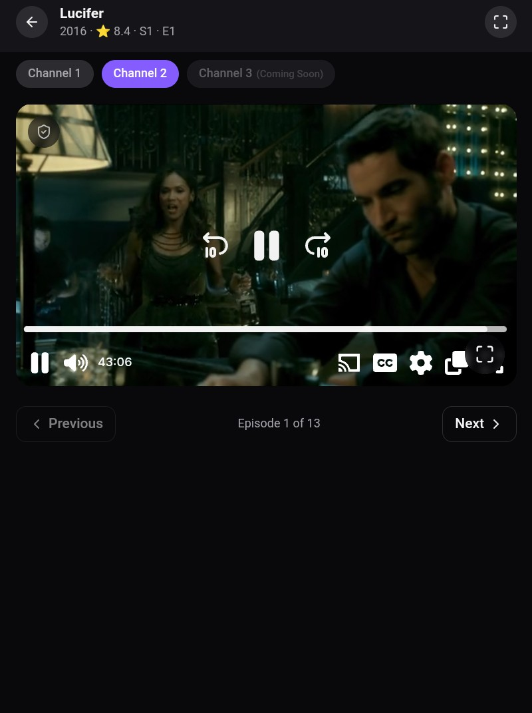
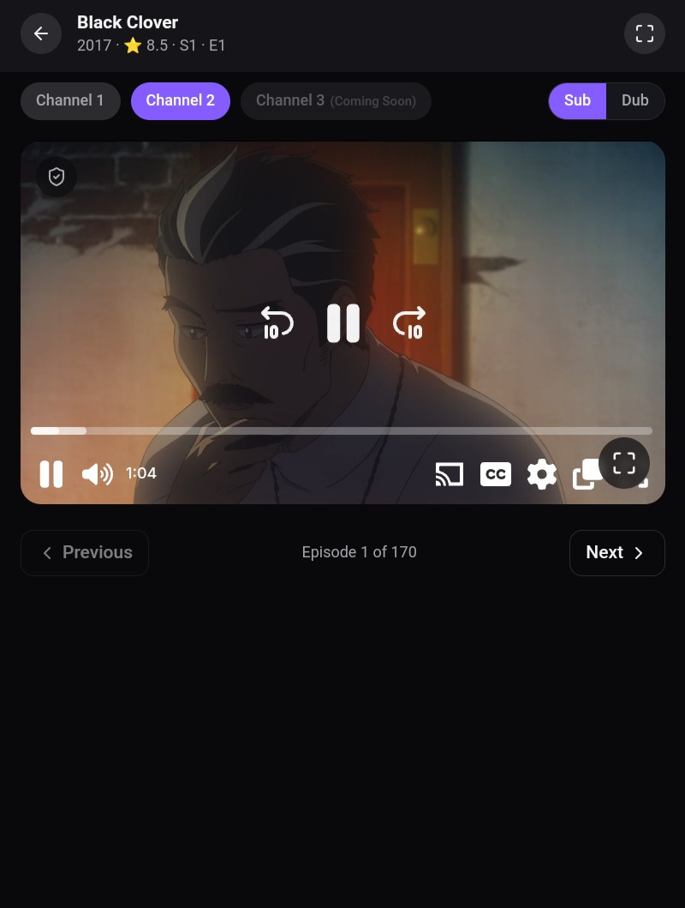

# D.Verse – Movie Hub
A modern streaming discovery platform for movies, TV series, and anime.


---

## Live Demo

🌐 **https://dverse.name.ng**

---

# About D.Verse

**D.Verse – Movie Hub** is a modern streaming discovery platform designed for people who love movies, series, and anime but hate endlessly scrolling through boring recommendations.

Instead of just showing random content, **D.Verse uses AI-powered discovery to help you actually find something worth watching.**

The platform combines multiple APIs, streaming sources, and an intelligent recommendation system to create a fast, smooth, and enjoyable entertainment hub.

Think of it as **a smarter way to discover what to watch next.**

Created by **Danny Daniels** under the **Danylix** brand.

---

# What Makes D.Verse Different

Most streaming platforms just show you content.

**D.Verse helps you discover it intelligently.**

The core of the platform is its **AI-powered discovery system**, designed to make finding great content faster and easier.

Instead of endless scrolling, the AI helps surface:

- Trending content
- Hidden gems
- Similar titles
- Smart recommendations

The goal is simple:

**Spend less time searching.  
Spend more time watching.**

---

# Features

### 🎬 Stream Movies & TV Series

Watch movies and TV series directly through integrated streaming providers using the built-in player.

Multiple channels ensure better playback availability.

---

### 🎌 Full Anime Support

Anime discovery and streaming are fully supported through **MyAnimeList data via the Jikan API**.

This allows D.Verse to provide:

- Trending anime
- Popular anime
- Seasonal releases
- Accurate episode information
- Anime recommendations

Anime streaming uses **MAL IDs** to ensure compatibility with streaming providers.

---

### 🤖 AI-Powered Discovery 

The AI system is the heart of D.Verse.

Powered through **OpenRouter.ai**, the platform uses modern AI models to improve how users discover content.

AI capabilities include:

- Intelligent movie and anime recommendations
- Context-aware content suggestions
- AI-assisted discovery of trending titles
- Smarter search results
- Personalized viewing suggestions

Instead of browsing endlessly, the AI helps guide you to something you'll actually enjoy watching.

---

### 🎥 Custom Video Player

D.Verse includes a custom video player built to improve playback and reduce intrusive interactions from embedded players.

Player capabilities include:

- Play / Pause controls
- Double-tap seek (forward & rewind)
- Fullscreen playback
- Mobile landscape mode
- Channel switching
- Sub / Dub toggle for anime

---

### 🔍 Smart Search

Search across the entire platform:

- Movies
- TV series
- Anime

Results return accurate posters, metadata, and descriptions.

---

### ⭐ Content Discovery

D.Verse surfaces curated sections such as:

- Trending movies
- Popular TV series
- Latest releases
- Seasonal anime
- Recommended titles

---

### 📱 Fully Responsive Design

The platform is optimized for:

- Mobile devices
- Tablets
- Desktop screens

Poster grids and layout automatically adapt to different screen sizes.

---

### ⬇️ Download Feature

The **download feature is currently in development** and will be released in a future update.

---

# App Preview

### Home Page


### Video Player


### Anime Section


---

# Technologies Used

D.Verse is built using a modern web stack designed for speed, scalability, and smooth user experience.

### Frontend

- React
- TypeScript
- Vite

### UI & Styling

- Tailwind CSS
- shadcn-ui

### APIs & Data Sources

- **TMDB API** — Movies and TV metadata
- **Jikan API** — Anime data from MyAnimeList

### AI

- **OpenRouter API** — AI models powering intelligent discovery and recommendations

### Streaming Providers

- VidSrc
- VidLink

---

# How to Run the Project Locally

You can run the project locally using Node.js and npm.

```sh
# Clone the repository
git clone <YOUR_GIT_URL>

# Navigate into the project directory
cd <YOUR_PROJECT_NAME>

# Install dependencies
npm install

# Run the development server
npm run dev
```

The app will start locally using Vite.

---

# Deployment

The project can be deployed directly through **Lovable**.

Open the project in Lovable and select:

```
Share → Publish
```

The live deployment is available at:

**https://dverse.name.ng**

---

# Roadmap

D.Verse is still evolving, with several exciting improvements planned.

### AI Enhancements

- Advanced AI recommendation engine
- Personalized viewing suggestions
- AI-powered semantic search
- Smarter content categorization

### Platform Features

- ⬇️ Media download system
- 👤 User accounts
- ⭐ Watchlists
- 📊 Viewing history
- 🔔 Notifications for new releases
- 🎞️ Additional streaming channels

---

# Disclaimer

D.Verse does **not host or store any video files**.

All streaming content is provided through third-party embedded sources.  
The platform functions only as a discovery and streaming interface.

---

# Creator

**Danny Daniels**  
Founder — **Danylix**

Building modern platforms, intelligent tools, and AI-driven digital experiences.

## Creator

**Danny Daniels**  
Founder – **Danylix**

Building modern digital platforms and intelligent software experiences.
